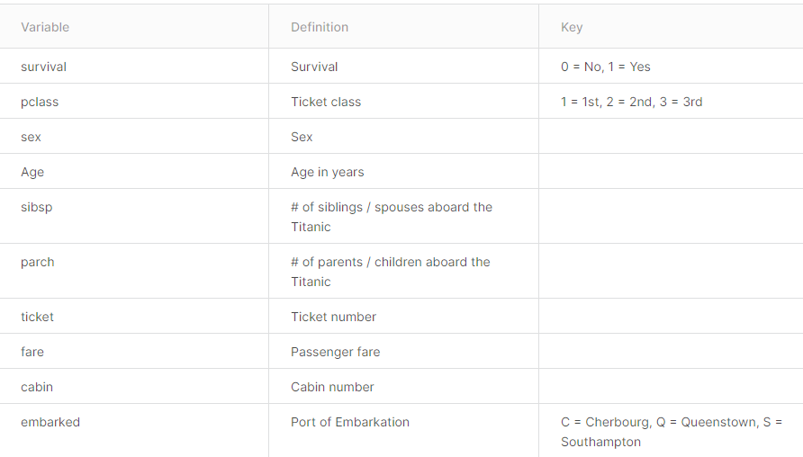

## Kaggle compete 
[click here to titanic home page](https://www.kaggle.com/c/titanic/overview)

hello!  

kaggle_Titanic.ipynb is my final code and submission.csv is my final result but it only get 77.9 point in kaggle.  
test.csv and train.csv is Official website data of Titanic

i find a interest code that is godlike.ipynb which is caculated by adjusted parameters  
It has nothing to do with my homework but i love it, so i put it here  
gptest.csv is the result which get a high point in kaggle  
  
